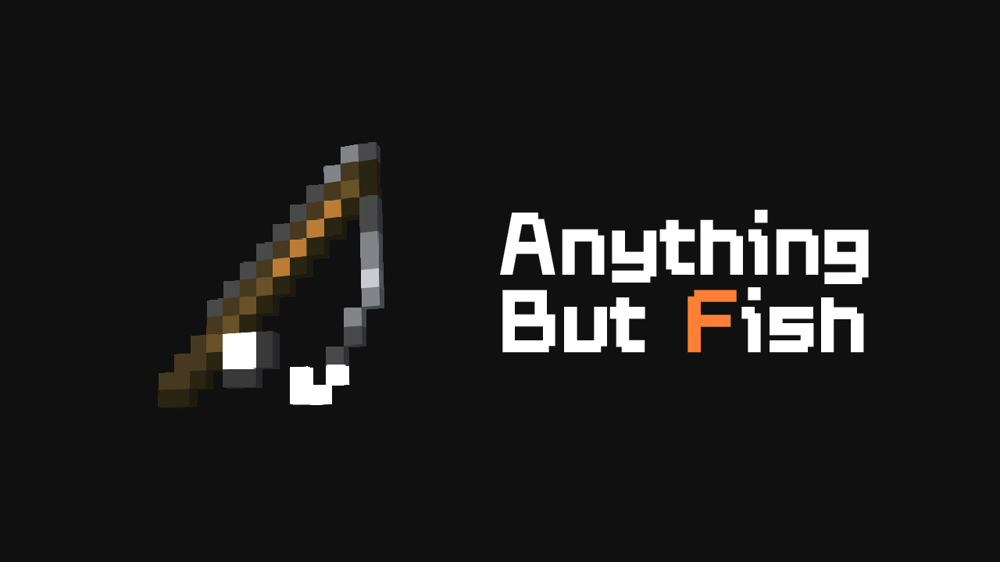

## Anything but Fish

You can now use the fishing rod to catch any item, including entities and objects.

### Introduction

**Forge?** Please click here:[anythingbutfish-forge](https://github.com/Lithum-12/anythingbutfish-forge)

The fishing rod is now empowered – you can fish up ANYTHING!

Including items, creatures, and even entities.

This mod completely overhauls the fishing rod mechanics, making it much more fun for random survival.

The mod only needs to be installed on the server; if also installed on the client, most settings can be tweaked via a GUI configuration screen.

### Compatibility

Supports Fabric 1.21.11,1.21.1,1.20.4,1.20.1,1.19.2,1.18.2,1.17.1

1.17.1 and above support Java 17, while 1.21.1 and above support Java 21.

***WARNING** 1.17.1 not supported on Java 16.*

1.16.x support is planned but not yet available.

Mod Menu and [Yet Another Config Lib](https://modrinth.com/mod/yacl) / [Cloth Config API](https://modrinth.com/mod/cloth-config) are optional – not required.

### Feedback

If you have any suggestions, please let me know! I am open to any ideas for new features or improvements.

If you find any bugs, please report them on the GitHub issue tracker or on the Modrinth page.

### License

This mod is licensed under the LGPLv3 License. You can find the full license text in the LICENSE file included with the mod.

This mod is not affiliated with Mojang AB or Microsoft Corporation. All rights reserved to their respective owners.

